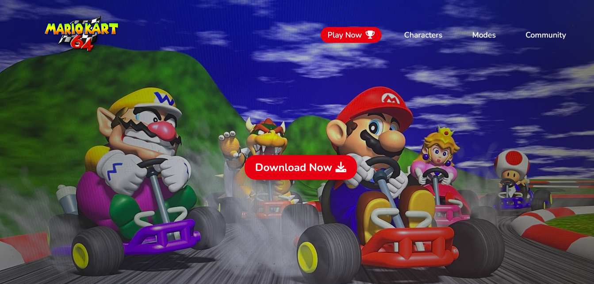
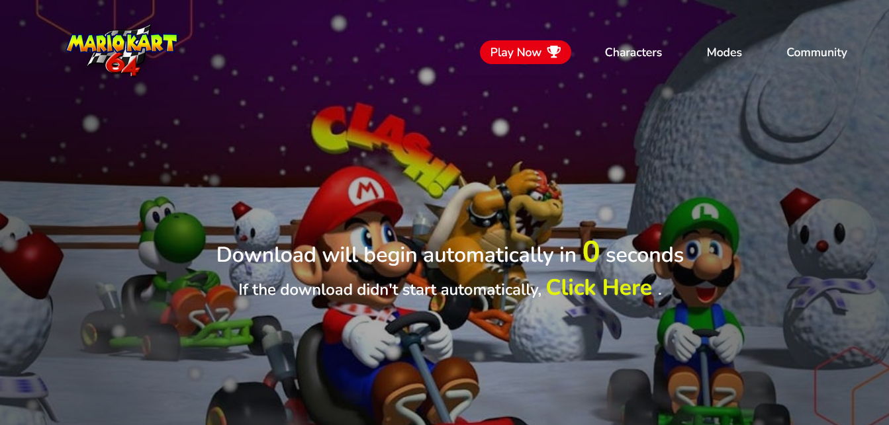
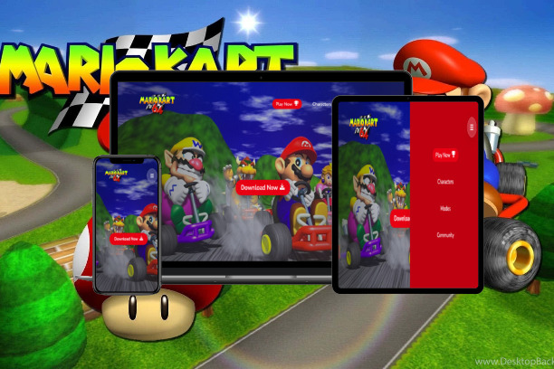

# Descarga Mario Kart 64
## Práctica de Todo
***
Este repositorio reune los conocimientos y conceptos adquiridos hasta ahora en mi aprendizaje de JavaScript. 
En el se hacen uso de funciones, temporizadores, DOM, Api de Sonido, eventos, entre otros.
Como punto adicional el se adapta a diferentes resoluciones de pantalla (Responsive Design).
***
## Conceptos y Tecnologías.
- HTML5
- CSS3
- Variables
- Funciones
- Timers: setTimeOut() & setInterval()
- Eventos
- Api de Sonido
- Document Object Model
***
Iniciamos con la pantalla inicial que nos muestra una barra de navegación y un botón para descargar un archivo, el cual encarna la raíz del proyecto, ya que una vez pulsado da ejecución a las funciones e instrucciones para la reproducción del sonido de alerta y descarga del fichero.

***
## Responsive Design

Este proyecto se encuentra en desarrollo y preparado para su posterior expansión. Espero haya sea de su agrado.

Autor: [ Grace Silva ](https://github.com/Grace-Silva)